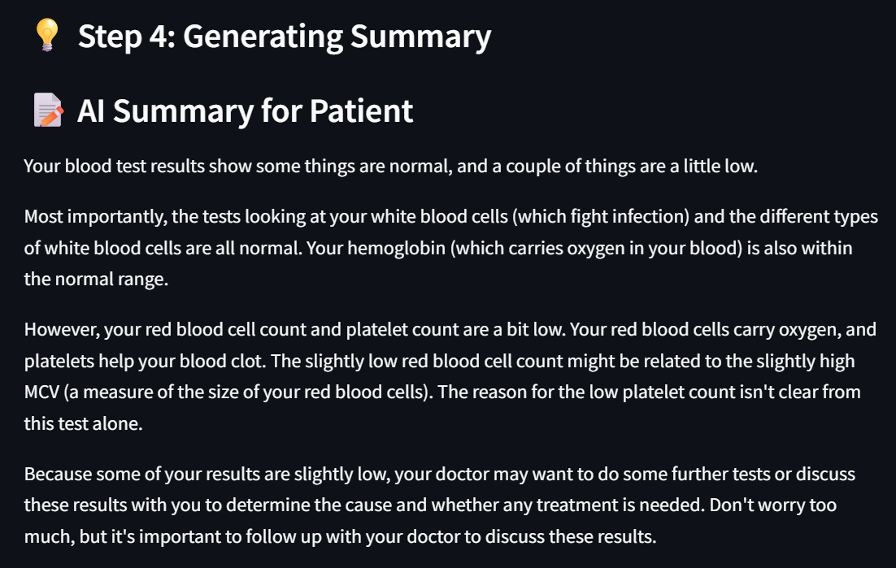

# 🧠 MediSage: AI-Powered Lab Report Analyzer

This project uses **Gemini AI** and **LangChain** to extract, interpret, and summarize information from **lab test reports** (PDF or image). It provides patients with an easy-to-understand health summary using advanced AI capabilities, and a smart chatbot for follow-up health questions.

🔄 Fully Automated Pipeline: From OCR-based text extraction to AI-powered lab result interpretation and natural language summary—everything happens in a single workflow with minimal user input.

🧠 Powered by Gemini + LangChain: Leverages Google's Gemini models through LangChain for accurate extraction and personalized summaries, with logic layers for interpretation based on medical reference ranges.

📦 Plug-and-Play for Health Apps: Designed to be modular and easily integrated into telemedicine platforms, personal health apps, or electronic health record (EHR) systems.

---

## 📸 Preview

 





---

## 🚀 Features

- 📄 **Upload Lab Reports** (PDF / JPG / PNG)
- 🔍 **OCR-Based Text Extraction** using PyMuPDF
- 🤖 **Lab Result Extraction** using Gemini 1.5 Flash (via LangChain)
- 📈 **Medical Interpretation** of lab values (high/low/normal)
- 📝 **Patient-Friendly Summary** generated by an LLM
- 💬 **AI Chatbot Support** to ask follow-up health-related questions

---

## 🛠️ Tech Stack

| Layer        | Technology                        |
|--------------|-----------------------------------|
| Frontend     | Streamlit                         |
| Backend      | Python                            |
| AI/LLM       | Gemini 1.5 Flash (`LangChain`)    |
| OCR Engine   | PyMuPDF (`fitz`), Tesseract       |
| Summarizer   | LangChain + Gemini                |
| Q&A Chatbot  | LangChain + Gemini                |

---

## 🧰 Installation

### 1. Clone the Repository

```bash
git clone https://github.com/shivangi1612/medisage.git.git
cd MediSage
